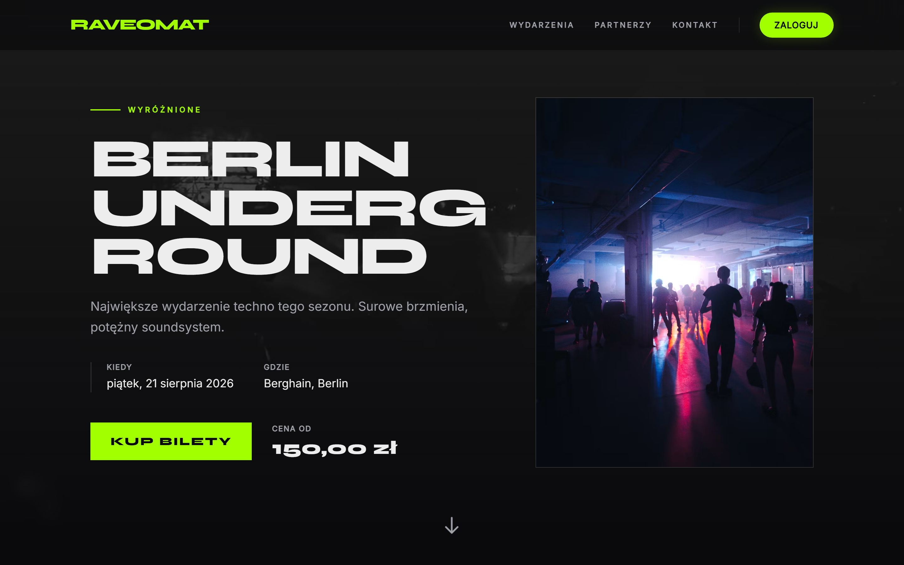
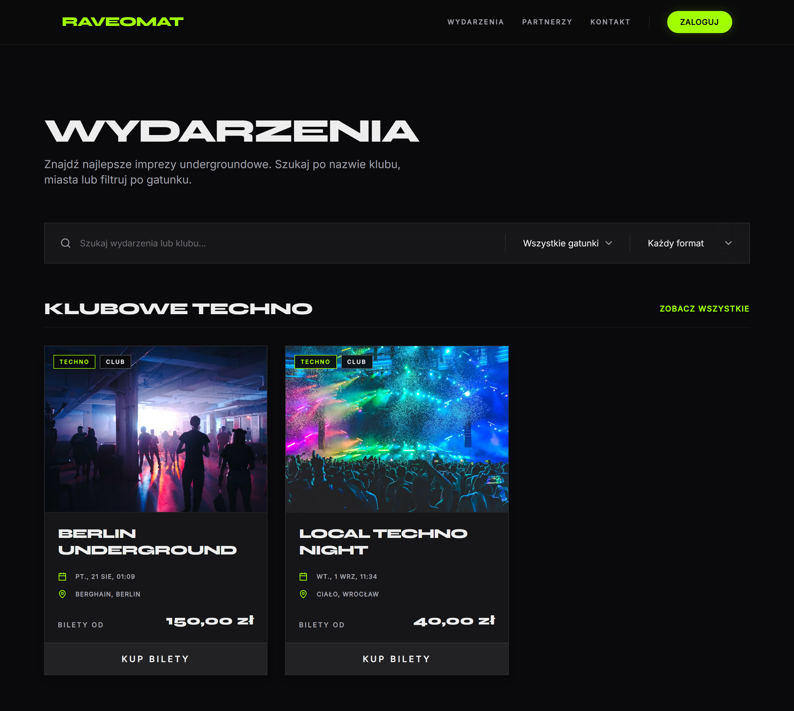
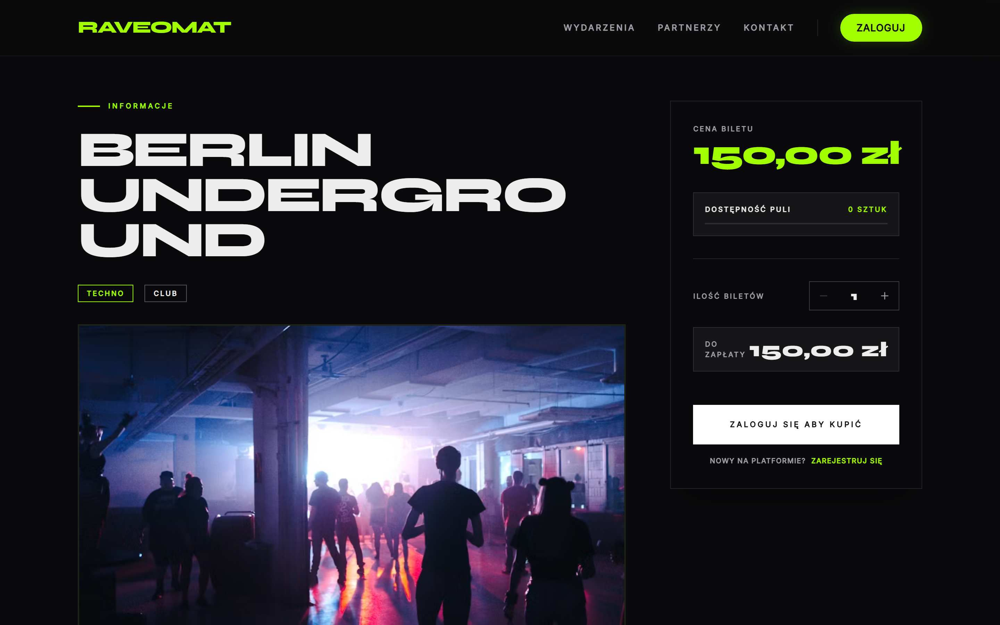
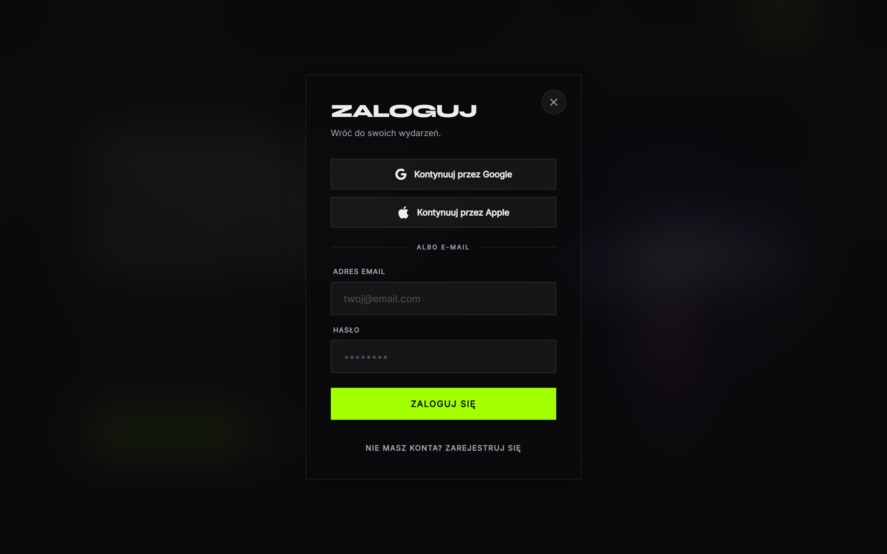

# Raveomat

*[English](README.md)*

Bilety na imprezy techno i rave: publiczny katalog wydarzeń i panel, w którym kluby i kolektywy wystawiają własne line-upy.

Projekt solo, napisany by nauczyć się o server-rendered islands w Astro i runes w Svelte 5 na czymś większym niż lista zadań.

**Stack:** Astro 6 (SSR) · Svelte 5 · Tailwind v4 · Supabase (Postgres + Auth + Storage) · Zod · TypeScript

## Zrzuty ekranu

Strona główna. Do hero trafiają tylko wydarzenia z `promo_tier` ustawionym na `pro`.



Katalog. Wyszukiwarka obejmuje nazwę wydarzenia i klub, filtry działają po stronie klienta.



Panel organizatora. Wydarzenia widać tylko w obrębie swojej organizacji, a plakaty są kadrowane przed wysłaniem do Storage.


<details>
<summary>Strona wydarzenia i logowanie</summary>





</details>

## Uruchomienie

```bash
npm install
cp .env.example .env    # PUBLIC_SUPABASE_URL i PUBLIC_SUPABASE_ANON_KEY
npm run dev
```

Potrzebny jest projekt Supabase. `supabase/schema.sql` to zrzut działającej bazy (tabele, enumy, funkcje, triggery, RLS), więc puszczenie go na świeżym projekcie daje gotową bazę. Numerowane pliki w `supabase/migrations/` to tylko historia i zakładają, że tabele bazowe już istnieją.

Upstash jest opcjonalny. Bez niego rate limiter działa na oknie w pamięci procesu.

## Co jest zaimplementowane

- **Część publiczna:** strona główna, katalog wydarzeń z wyszukiwarką i filtrami, strony wydarzeń z paskiem dostępności puli, katalog partnerów, formularze newslettera i kontaktu.
- **Panel organizatora:** sidebar powstaje z Twojego członkostwa, więc bez organizacji nie ma zakładek z wydarzeniami. CRUD wydarzeń ma cropper na canvasie, który wysyła przycięty plakat, a nie oryginał.
- **Autoryzacja:** Supabase Auth na ciasteczkach SSR, `/panel/*` pilnowany w middleware. Logowanie, rejestracja, zmiana i reset hasła.
- **Anti-abuse:** publiczne formularze idą przez Astro Actions ze schematami Zod, polem honeypot i rate limiterem kluczowanym po IP i po e-mailu. Identyfikatory są hashowane, więc surowe adresy nigdzie nie lądują.
- **Wydajność i SEO:** Brotli/gzip w middleware, responsywny `srcset` przez transformacje Unsplash i Supabase, JSON-LD, sitemap, tagi OG.

## Status

Niedokończona część to sprzedaż biletów. Baza modeluje `orders`, `tickets`, `ticket_scans`, `refunds` i progi cenowe, ale checkout kończy się na wyborze liczby biletów: brak płatności, generowania QR i działającego skanera. Zakładki portfela i skanera to placeholdery.

Zarządzanie wydarzeniami, autoryzacja i część publiczna działają od początku do końca.
